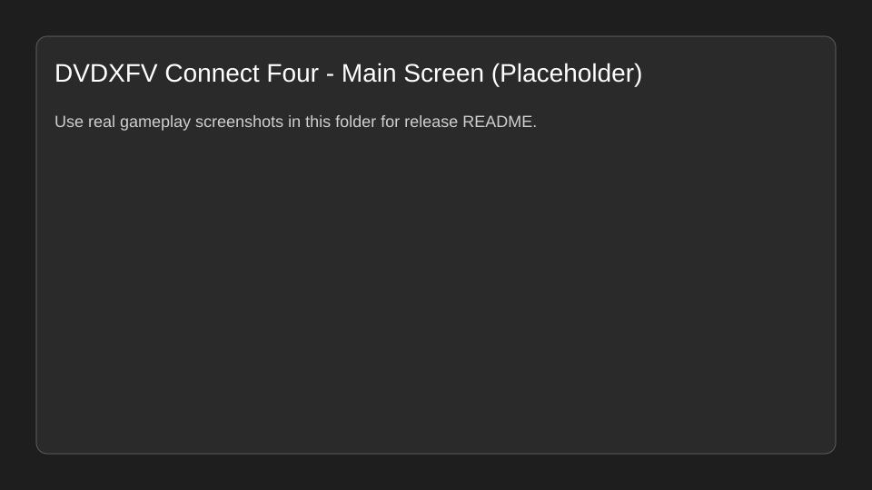
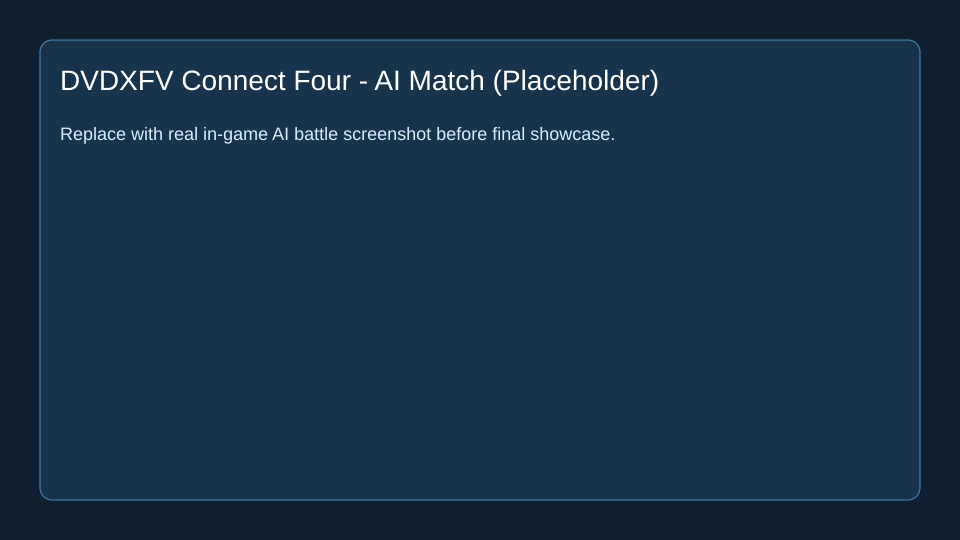

# DVDXFV Connect Four

## 给玩家：去哪下载 exe/安装包

请到本仓库的 [Releases](https://github.com/dvdxfv/dvdxfv-connect4/releases) 页面下载 Windows 可执行文件。

| 附件名 | 适合谁 | 怎么用 |
|---|---|---|
| `dvdxfv-connect4-setup.exe` | 普通玩家（推荐） | 双击安装，按向导完成安装后从桌面快捷方式启动 |
| `dvdxfv-connect4-portable.exe` | 不想安装、临时试玩 | 直接双击运行，无需安装 |

不确定选哪个时，优先下载 `*_Setup.exe`（本项目对应为 `dvdxfv-connect4-setup.exe`）。

若当前还没有可用 Release，请维护者按以下步骤发布：
1. 在 GitHub 仓库点击 **Create a new release**。
2. 创建 tag（如 `v2.0`）并填写版本说明。
3. 上传 `dvdxfv-connect4-portable.exe` 和 `dvdxfv-connect4-setup.exe` 两个 Assets。
4. 发布后回到本 README 确认下载链接可用。

---

## 1. 项目一句话

一个面向 Windows 的四子棋桌面游戏，支持人机对战与本地双人对战，并通过 Releases 提供即下即玩的安装包与便携版。

---

## 2. Why I Built This

做这个项目是为了把「轻量、可离线运行、上手快」的四子棋体验做成可直接分发的 Windows 程序。相比命令行或网页试玩，桌面版更适合本地长期保留，安装后可直接从桌面打开，便携版也可用于临时体验。

---

## 3. The Real Problem

真正要解决的问题不是“做出一个棋盘界面”，而是让非开发者也能零门槛拿到并运行游戏：
- 玩家不知道该下哪个包、怎么安装、是否需要 Python 环境；
- 发布时如果只放源码，普通用户安装成本高；
- 缺少统一的演示与版本日志，难以快速判断当前版本状态。

---

## 4. My Product Thinking

这个项目优先保证“下载就能玩”：
- 安装版负责长期使用体验（快捷方式、系统集成）；
- 便携版负责零安装试玩；
- README 聚焦玩家下载入口与使用路径；
- 代码仓库保持轻量，二进制通过 Releases 分发，降低仓库体积与维护成本。

---

## 5. Workflow

```text
本地构建/准备可执行文件
↓
执行 packaging/release-assets.ps1 生成标准化附件名
↓
创建 Git tag（如 v2.0）
↓
创建 GitHub Release 并上传两个 exe 资产
↓
更新 README 版本摘要与演示内容
```

---

## 6. Core Features

| 功能 | 解决的问题 |
|---|---|
| 人机对战 | 单人可随时开局，不依赖第二位玩家 |
| 本地双人对战 | 同屏对弈，适合线下娱乐 |
| 安装版分发 | 对普通玩家更友好，启动路径固定 |
| 便携版分发 | 不改系统环境即可快速试玩 |
| Release 资产标准化 | 统一附件命名，降低下载和维护歧义 |

---

## 7. What I Built

```text
Runtime: Windows packaged executable distribution
Docs: README + developer logs + demo assets
Packaging: PowerShell release asset normalization script
Release: Git tags + GitHub Release assets workflow
```

工程上将“游戏运行产物”和“仓库可维护内容”分开：仓库主要管理文档、发布脚本、版本信息；大体积二进制通过 Release Assets 交付给玩家。

---

## 8. Demo



* **图 1** — 主界面场景：默认窗口状态（占位示意，待替换为真实截图）。*



* **图 2** — AI 对战场景：对局进行中状态（占位示意，待替换为真实截图）。*

视频演示（建议下载本地观看大文件）：[点击下载演示视频](docs/demo/gameplay-demo.mp4)

---

## 9. Hard Parts

最难的点在于发布链路而不是棋盘逻辑本身：如何在不污染仓库历史的前提下管理 exe、如何让附件命名稳定、以及如何确保文档路径在结构迁移后全部有效。

---

## 10. What I Learned

我把“能跑”与“能持续发布”拆开处理：前者靠可执行程序，后者靠结构化仓库、统一命名和可复制的发布流程。这样后续版本迭代时维护成本更低。

---

## 11. Current Limitations

- 当前仓库以发布与文档治理为主，源码未在本仓库公开管理。
- README 中演示图目前是占位示意，需替换为真实游戏截图。
- 视频文件尚未放入 `docs/demo/`。

---

## 12. Next Steps

- 补充真实游戏截图与录屏到 `docs/demo/`（ASCII 文件名）。
- 补充 `docs/developer-log-v3.txt` 并同步版本摘要。
- 继续完善安装包与便携版自动化构建流程。

---

## 13. One Sentence Summary

这是一个以“玩家可直接下载运行”为核心目标，并围绕 GitHub Releases 完成规范化发布流程的四子棋项目。

---

## 附录 A · 仓库目录与运行入口

```text
.
├── README.md
├── LICENSE
├── requirements.txt
├── src/
│   └── ENTRYPOINT.md
├── docs/
│   ├── demo/
│   │   ├── demo-main-screen.svg
│   │   └── demo-ai-match.svg
│   ├── developer-log-v1.txt
│   └── developer-log-v2.txt
└── packaging/
    └── release-assets.ps1
```

运行入口（分发形态）：
- 便携版：`dvdxfv-connect4-portable.exe`
- 安装版：`dvdxfv-connect4-setup.exe`

---

## 附录 B · 快速开始与环境依赖

1. 系统：Windows 10/11。  
2. 开发机发布前准备：确保根目录存在本地构建的两个 exe（安装版 + 便携版）。  
3. 生成标准附件名：
   - `powershell -ExecutionPolicy Bypass -File packaging/release-assets.ps1`
4. 到 `release-assets/` 取出两个 exe 上传到 GitHub Release。

---

## 附录 C · Demo 素材与图注规范

- 素材目录：`docs/demo/`（仅 ASCII 文件名）。
- 每张图必须有图注（编号 + 场景 + UI 状态）。
- 视频在 README 中提供可点击链接，并注明“大文件建议下载本地看”。

---

## 附录 D · 与开发者日志对齐

当前 README 的版本摘要与发布流程对齐以下日志文件：
- `docs/developer-log-v1.txt`
- `docs/developer-log-v2.txt`

---

## 附录 E · 开源与协作

- License: MIT（见 `LICENSE`）。
- 发布策略：仓库跟踪文档与脚本，二进制由 GitHub Releases 托管。

---

## 附录 F · 自检清单

- [x] 下载入口在文首，且给出安装版/便携版说明。
- [x] Demo 采用 `` 形式并附图注。
- [x] 目录结构与路径引用使用 ASCII 路径。
- [x] README 版本摘要已对齐开发者日志。
