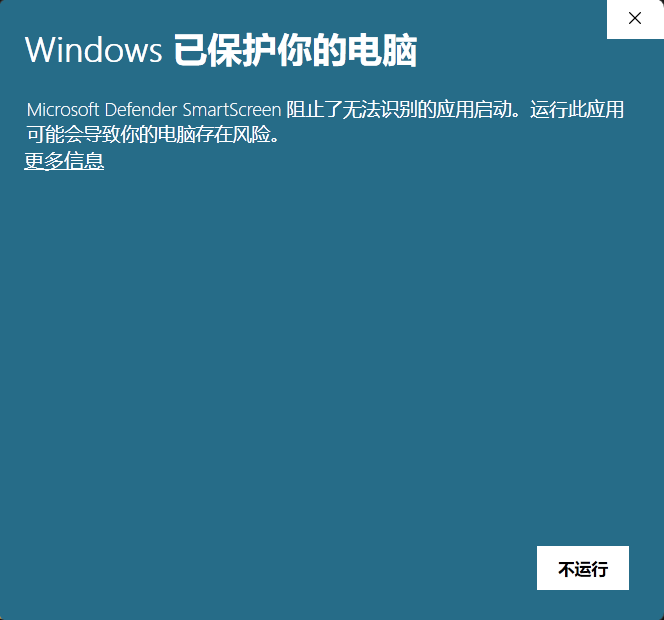
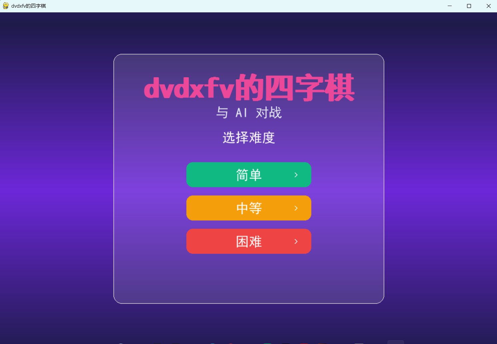
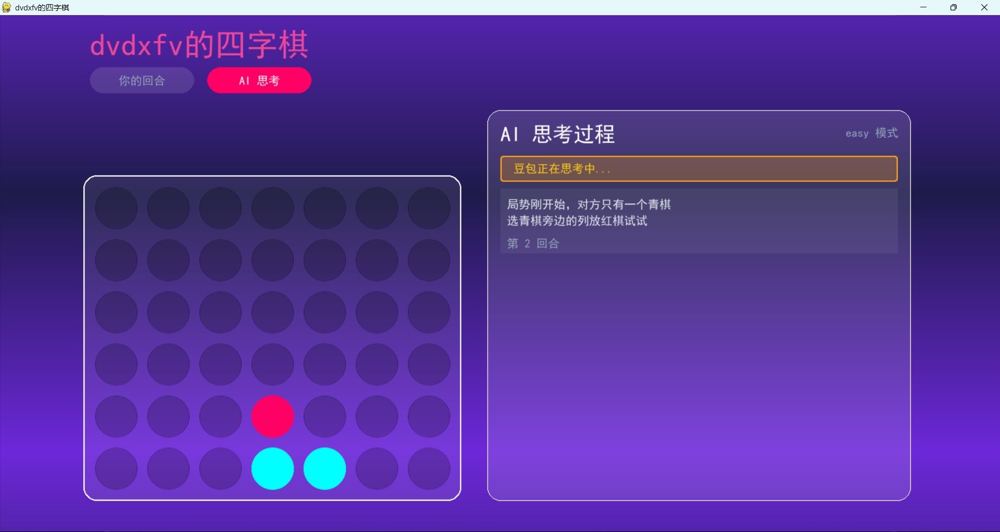
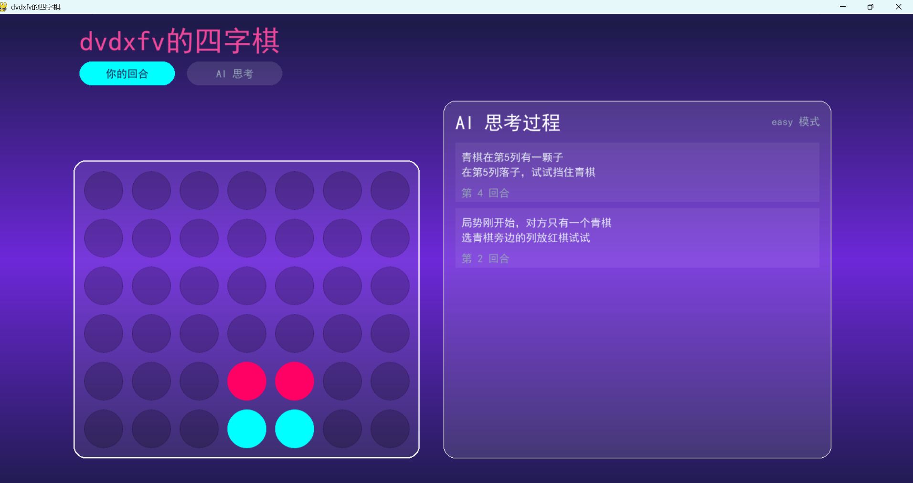

# DVDXFV Connect Four

## 给玩家：去哪下载安装包

请优先从本仓库的 [Releases 页面](https://github.com/dvdxfv/dvdxfv-connect4/releases) 下载 Windows 安装包。  
若该链接在网络环境下无法直接打开，可进入仓库主页后手动点击 **Releases** 标签。


- 当前对外发布附件：`dvdxfv-connect4-setup.exe`（安装版）。
- 下载后双击安装，按向导完成后从桌面快捷方式启动。

> 安装时若出现“Windows 已保护你的电脑（Microsoft Defender SmartScreen）”：
> 1. 点击“更多信息”
> 2. 点击“仍要运行”
> 即可继续安装。
>
> 说明：该提示通常表示“发布者信誉尚未建立”，不等于程序有毒。后续会通过安装包代码签名进一步减少此提示。



* 安装时的 SmartScreen 提示：属于 Windows 对未知发布者的常见拦截提示，不代表程序有毒；按“更多信息 -> 仍要运行”可继续安装，后续将通过代码签名优化该体验。*

---

## 1. 项目一句话

一个面向 Windows 的四子棋桌面游戏，当前以人机对战（AI）为主，开箱即玩。

---

## 2. Why I Built This

这个项目的目标很直接：把四子棋做成普通用户也能直接下载运行的桌面游戏，不要求玩家安装 Python 或配置开发环境。

---

## 3. 游戏特色

- **人机对战（AI）**：开发者日志已记录该模式可用。
- **安装包部署**：安装后可通过桌面快捷方式启动。
- **开箱即用**：普通用户无需手动配置 Python 运行环境。

---

## 4. Core Features


| 功能   | 说明 |
| ---- | ---- |
| 人机模式 | 支持与 AI 对战 |
| 安装版分发 | 面向普通玩家，安装后直接从快捷方式启动 |
| 运行环境内置 | 无需玩家自行准备 Python 依赖 |


---

## 5. Demo（实际截图）



* **图 1** — 游戏主界面：主界面状态。*



* **图 2** — 对局进行中：实际对局画面。*



* **图 3** — 对局界面：实际游戏画面。*

---

## 6. 仓库目录与入口

```text
.
├── README.md                         # 项目主页与下载说明
├── LICENSE                           # MIT 许可证
├── requirements.txt                  # 依赖占位文件
├── src/                              # 源码/入口说明目录
│   └── ENTRYPOINT.md                 # 运行入口说明（中文注释见下）
├── docs/                             # 文档目录
│   ├── demo/                         # README 演示截图
│   │   ├── screenshot-01-main-menu.png
│   │   ├── screenshot-02-playing-board.png
│   │   └── screenshot-03-result-state.png
│   ├── developer-log-v1.txt          # 游戏说明与运行日志
│   └── developer-log-v2.txt          # 仓库结构与发布日志
└── packaging/
    ├── release-assets.ps1            # 发布附件重命名脚本
    ├── installer.iss                 # Inno Setup 安装包脚本（默认创建桌面快捷方式）
    └── build-installer.ps1           # 一键编译安装包脚本
```

运行入口（分发形态）：

- 安装版：`dvdxfv-connect4-setup.exe`（安装后从桌面快捷方式启动）

---

## 7. 使用的 AI 说明

- 根据 `docs/developer-log-v1.txt`，游戏会在联网时尝试连接**云端 AI**进行对弈。
- 若云端连接不可用，会切换到本地模式或给出提示。

---

## 8. 开发者日志

版本摘要与记录见：

- `docs/developer-log-v1.txt`
- `docs/developer-log-v2.txt`

---

## 许可证

本项目在 **MIT License** 下开源，完整条文见仓库根目录 `[LICENSE](LICENSE)`。

> 第三方依赖（如 [Pygame](https://www.pygame.org/)）分别遵循其各自许可证；分发或打包时需一并遵守。

署名： **DVDXFV**；联系邮箱写在 `[LICENSE](LICENSE)` 首行版权说明中。